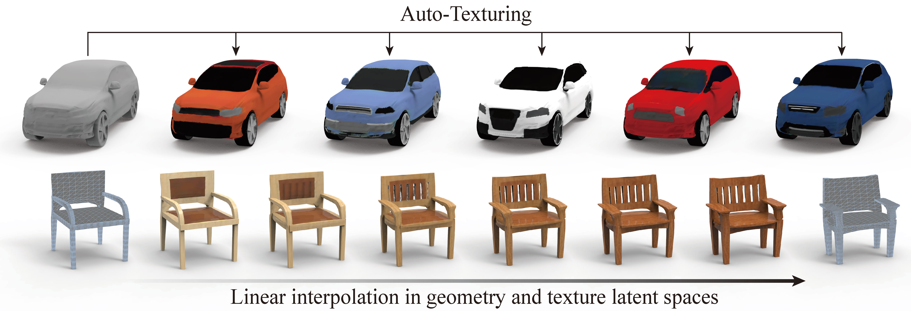

# TM-NET: Deep Generative Networks for Textured Meshes

This is a Python3 / Pytorch implementation of TM-NET.


1. [Setup](#Setup)
2. [Prepare Data](#Prepare Data)
3. [Training and Test](#Training and Test)
4. [DEMO](#DEMO)

# Setup

To run this code you need the following:

- A machine with multiple GPUs(memory >= 12GB)

- Python packages in the requirements.txt
```
pip install -r requirements.txt
```

# Prepare Data
1. Run ```GetTransformedCube.m``` to get transformed a mini bounding box which will be used as source shape in non-rigid registration for each partial 3D model.
2. Run ```SupportAnalysis.m``` to extract structure information from the partial ```obj``` files producing a corresponding ```code.mat``` for each 3D model.
3. Run ```register.m``` to perform non-rigid registrations from transformed mini bounding boxes to original partial 3D models.
4. Run ```generate_data.m``` to extract deformation information between source shapes and registered shapes which will be used as the input of ```TM-NET```.
5. Run ```TransferColorPerPixelScript.m``` to generate texture images for registered parts.

   An example is shown in ```Pipeline.m```.

# Training and Test

- Train PartVAE for each part
```shell
python train_geo.py --mat_dir ../data/all/car/train --ref_mesh_mat ../data/all/car_std.mat --ckpt_dir ./car_geo_ckpt --batch_size 32 --part_name body --device 0
python train_geo.py --mat_dir ../data/all/car/train --ref_mesh_mat ../data/all/car_std.mat --ckpt_dir ./car_geo_ckpt --batch_size 32 --part_name left_back_wheel --device 0
python train_geo.py --mat_dir ../data/all/car/train --ref_mesh_mat ../data/all/car_std.mat --ckpt_dir ./car_geo_ckpt --batch_size 32 --part_name left_front_wheel --device 0
python train_geo.py --mat_dir ../data/all/car/train --ref_mesh_mat ../data/all/car_std.mat --ckpt_dir ./car_geo_ckpt --batch_size 32 --part_name left_mirror --device 0
python train_geo.py --mat_dir ../data/all/car/train --ref_mesh_mat ../data/all/car_std.mat --ckpt_dir ./car_geo_ckpt --batch_size 32 --part_name right_back_wheel --device 0
python train_geo.py --mat_dir ../data/all/car/train --ref_mesh_mat ../data/all/car_std.mat --ckpt_dir ./car_geo_ckpt --batch_size 32 --part_name right_front_wheel --device 0
python train_geo.py --mat_dir ../data/all/car/train --ref_mesh_mat ../data/all/car_std.mat --ckpt_dir ./car_geo_ckpt --batch_size 32 --part_name right_mirror --device 0
```

- Test PartVAE reconstruction (OPTIONAL)
```shell
python train_geo.py --mat_dir ../data/all/car/train --ref_mesh_mat ../data/all/car_std.mat --ckpt_dir ./car_geo_ckpt/body --load_ckpt --is_test 1 --part_name body --batch_size 1 --device 0
python train_geo.py --mat_dir ../data/all/car/train --ref_mesh_mat ../data/all/car_std.mat --ckpt_dir ./car_geo_ckpt/left_back_wheel --load_ckpt --is_test 1 --part_name left_back_wheel --batch_size 1 --device 0
python train_geo.py --mat_dir ../data/all/car/train --ref_mesh_mat ../data/all/car_std.mat --ckpt_dir ./car_geo_ckpt/left_front_wheel --load_ckpt --is_test 1 --part_name left_front_wheel --batch_size 1 --device 0
python train_geo.py --mat_dir ../data/all/car/train --ref_mesh_mat ../data/all/car_std.mat --ckpt_dir ./car_geo_ckpt/left_mirror --load_ckpt --is_test 1 --part_name left_mirror --batch_size 1 --device 0
python train_geo.py --mat_dir ../data/all/car/train --ref_mesh_mat ../data/all/car_std.mat --ckpt_dir ./car_geo_ckpt/right_back_wheel --load_ckpt --is_test 1 --part_name right_back_wheel --batch_size 1 --device 0
python train_geo.py --mat_dir ../data/all/car/train --ref_mesh_mat ../data/all/car_std.mat --ckpt_dir ./car_geo_ckpt/right_front_wheel --load_ckpt --is_test 1 --part_name right_front_wheel --batch_size 1 --device 0
python train_geo.py --mat_dir ../data/all/car/train --ref_mesh_mat ../data/all/car_std.mat --ckpt_dir ./car_geo_ckpt/right_mirror --load_ckpt --is_test 1 --part_name right_mirror --batch_size 1 --device 0
```

- Extract PartVAE latents
```
python extract_latents_geo_only_all_parts.py --mat_dir ../data/all/car/train --ref_mesh_mat ../data/all/car_std.mat --geo_ckpt_dir ./car_geo_ckpt --category car --save_path ./geo_all_parts --device 0
```

- Train SP-VAE for each shape
```shell
python  train_spvae.py --path ./geo_all_parts/ --ckpt_dir ./car_spvae_ckpt --category car --batch_size 512 --device 0
```

- Train VQVAE for each part
```shell
python train_vqvae_patch.py --image_dir ../data/all/car/train --ckpt_dir ./car_patch_vqvae_ckpt --part_name body --device 0
python train_vqvae_patch.py --image_dir ../data/all/car/train --ckpt_dir ./car_patch_vqvae_ckpt --part_name left_back_wheel --device 0
python train_vqvae_patch.py --image_dir ../data/all/car/train --ckpt_dir ./car_patch_vqvae_ckpt --part_name left_front_wheel --device 0
python train_vqvae_patch.py --image_dir ../data/all/car/train --ckpt_dir ./car_patch_vqvae_ckpt --part_name left_mirror --device 0
python train_vqvae_patch.py --image_dir ../data/all/car/train --ckpt_dir ./car_patch_vqvae_ckpt --part_name right_back_wheel --device 0
python train_vqvae_patch.py --image_dir ../data/all/car/train --ckpt_dir ./car_patch_vqvae_ckpt --part_name right_front_wheel --device 0
python train_vqvae_patch.py --image_dir ../data/all/car/train --ckpt_dir ./car_patch_vqvae_ckpt --part_name right_mirror --device 0
```

- Test VQVAE reconstruction(OPTIONAL)
```shell
python train_vqvae_patch.py --image_dir ../data/all/car/test --ckpt_dir ./car_patch_vqvae_ckpt/body --part_name body --load_ckpt --is_test 1 --device 0
python train_vqvae_patch.py --image_dir ../data/all/car/test --ckpt_dir ./car_patch_vqvae_ckpt/left_back_wheel --part_name left_back_wheel --load_ckpt --is_test 1 --device 0
python train_vqvae_patch.py --image_dir ../data/all/car/test --ckpt_dir ./car_patch_vqvae_ckpt/left_front_wheel --part_name left_front_wheel --load_ckpt --is_test 1 --device 0
python train_vqvae_patch.py --image_dir ../data/all/car/test --ckpt_dir ./car_patch_vqvae_ckpt/left_mirror --part_name left_mirror --load_ckpt --is_test 1 --device 0
python train_vqvae_patch.py --image_dir ../data/all/car/test --ckpt_dir ./car_patch_vqvae_ckpt/right_back_wheel --part_name right_back_wheel --load_ckpt --is_test 1 --device 0
python train_vqvae_patch.py --image_dir ../data/all/car/test --ckpt_dir ./car_patch_vqvae_ckpt/right_front_wheel --part_name right_front_wheel --load_ckpt --is_test 1 --device 0
python train_vqvae_patch.py --image_dir ../data/all/car/test --ckpt_dir ./car_patch_vqvae_ckpt/right_mirror --part_name right_mirror --load_ckpt --is_test 1 --device 0

```

- Extract discrete code for the central part in the training set
```shell
python extract_latents_central_part.py --mat_dir ../data/all/car/train --ref_mesh_mat ../data/all/car_std.mat --geo_ckpt ./car_geo_ckpt/body/geovae_newest.pt  --vqvae_ckpt ./car_patch_vqvae_ckpt/body/vqvae_newest.pt --save_path ./car_latents_with_geo_train --device 2 --category car
```

- Train conditional PixelSNAIL for the central part
```shell
python train_pixelsnail_with_geo_condition_2levels_central_part.py --hier top  ./car_latents_with_geo_train/body --batch 1 --device 2
python train_pixelsnail_with_geo_condition_2levels_central_part.py --hier bottom  ./car_latents_with_geo_train/body --batch 1 --device 2
```

- Extract discrete code for other parts in the training set
```shell
python extract_latents_other_parts.py --mat_dir ../data/all/car/train --ref_mesh_mat ../data/all/car_std.mat --geo_ckpt_dir ./car_geo_ckpt --vqvae_ckpt_dir ./car_patch_vqvae_ckpt --save_path ./car_latents_with_geo_train --category car --device 2
```

- Train conditional PixelSNAIL for other parts
```shell
python train_pixelsnail_with_geo_condition_2levels_other_parts.py --hier top ./car_latents_with_geo_train/left_back_wheel --batch 1 --part_name left_back_wheel --device 2
python train_pixelsnail_with_geo_condition_2levels_other_parts.py --hier top ./car_latents_with_geo_train/left_front_wheel --batch 1 --part_name left_front_wheel --device 2
python train_pixelsnail_with_geo_condition_2levels_other_parts.py --hier top ./car_latents_with_geo_train/left_mirror --batch 1 --part_name left_mirror --device 2
python train_pixelsnail_with_geo_condition_2levels_other_parts.py --hier top ./car_latents_with_geo_train/right_back_wheel --batch 1 --part_name right_back_wheel --device 2
python train_pixelsnail_with_geo_condition_2levels_other_parts.py --hier top ./car_latents_with_geo_train/right_front_wheel --batch 1 --part_name right_front_wheel --device 2
python train_pixelsnail_with_geo_condition_2levels_other_parts.py --hier top ./car_latents_with_geo_train/right_mirror --batch 1 --part_name right_mirror --device 2

python train_pixelsnail_with_geo_condition_2levels_other_parts.py --hier bottom  ./car_latents_with_geo_train/left_back_wheel --batch 1 --part_name left_back_wheel --device 2
python train_pixelsnail_with_geo_condition_2levels_other_parts.py --hier bottom  ./car_latents_with_geo_train/left_front_wheel --batch 1 --part_name left_front_wheel --device 2
python train_pixelsnail_with_geo_condition_2levels_other_parts.py --hier bottom  ./car_latents_with_geo_train/left_mirror --batch 1 --part_name left_mirror --device 2
python train_pixelsnail_with_geo_condition_2levels_other_parts.py --hier bottom  ./car_latents_with_geo_train/right_back_wheel --batch 1 --part_name right_back_wheel --device 2
python train_pixelsnail_with_geo_condition_2levels_other_parts.py --hier bottom  ./car_latents_with_geo_train/right_front_wheel --batch 1 --part_name right_front_wheel --device 2
python train_pixelsnail_with_geo_condition_2levels_other_parts.py --hier bottom  ./car_latents_with_geo_train/right_mirror --batch 1 --part_name right_mirror --device 2
```

- Extract geometry latent for the central part in the test set
```shell
python extract_latents_central_part.py --mat_dir ../data/all/car/test --ref_mesh_mat ../data/all/car_std.mat --geo_ckpt ./car_geo_ckpt/body/geovae_newest.pt --vqvae_ckpt ./car_patch_vqvae_ckpt/body/vqvae_newest.pt --save_path ./car_latents_with_geo_test --category car --device 0
```

- Sample texture for the central part
```shell
python conditional_sample_2levels_central_part.py  --vqvae ./car_patch_vqvae_ckpt/body/vqvae_newest.pt --top ./condition_ckpt/body/pixelsnail_top.pt --bottom ./condition_ckpt/body/pixelsnail_bottom.pt --path ./car_latents_with_geo_test/body --device 0
```

- Extract geometry latent for other parts in the test set
```shell
python extract_latents_other_parts.py --mat_dir ../data/all/car/test --ref_mesh_mat ../data/all/car_std.mat --geo_ckpt_dir ./car_geo_ckpt --vqvae_ckpt_dir ./car_patch_vqvae_ckpt --save_path ./car_latents_with_geo_test --category car --device 0
```

- Sample texture for other parts
```shell
python conditional_sample_2levels_other_parts.py --vqvae ./car_patch_vqvae_ckpt/left_back_wheel/vqvae_newest.pt --top ./condition_ckpt/left_back_wheel/pixelsnail_top.pt --bottom ./condition_ckpt/left_back_wheel/pixelsnail_bottom.pt --path ./car_latents_with_geo_test/left_back_wheel --central_part_sample_dir ./condition_ckpt/body/auto_texture --device 0
python conditional_sample_2levels_other_parts.py --vqvae ./car_patch_vqvae_ckpt/left_front_wheel/vqvae_newest.pt --top ./condition_ckpt/left_front_wheel/pixelsnail_top.pt --bottom ./condition_ckpt/left_front_wheel/pixelsnail_bottom.pt --path ./car_latents_with_geo_test/left_front_wheel --central_part_sample_dir ./condition_ckpt/body/auto_texture --device 0
python conditional_sample_2levels_other_parts.py --vqvae ./car_patch_vqvae_ckpt/left_mirror/vqvae_newest.pt --top ./condition_ckpt/left_mirror/pixelsnail_top.pt --bottom ./condition_ckpt/left_mirror/pixelsnail_bottom.pt --path ./car_latents_with_geo_test/left_mirror --central_part_sample_dir ./condition_ckpt/body/auto_texture --device 0

python conditional_sample_2levels_other_parts.py --vqvae ./car_patch_vqvae_ckpt/right_back_wheel/vqvae_newest.pt --top ./condition_ckpt/right_back_wheel/pixelsnail_top.pt --bottom ./condition_ckpt/right_back_wheel/pixelsnail_bottom.pt --path ./car_latents_with_geo_test/right_back_wheel --central_part_sample_dir ./condition_ckpt/body/auto_texture --device 0
python conditional_sample_2levels_other_parts.py --vqvae ./car_patch_vqvae_ckpt/right_front_wheel/vqvae_newest.pt --top ./condition_ckpt/right_front_wheel/pixelsnail_top.pt --bottom ./condition_ckpt/right_front_wheel/pixelsnail_bottom.pt --path ./car_latents_with_geo_test/right_front_wheel --central_part_sample_dir ./condition_ckpt/body/auto_texture --device 0
python conditional_sample_2levels_other_parts.py --vqvae ./car_patch_vqvae_ckpt/right_mirror/vqvae_newest.pt --top ./condition_ckpt/right_mirror/pixelsnail_top.pt --bottom ./condition_ckpt/right_mirror/pixelsnail_bottom.pt --path ./car_latents_with_geo_test/right_mirror --central_part_sample_dir ./condition_ckpt/body/auto_texture --device 0
```

# View Results
1. Run ```ViewOBJandTexture.m``` to generate single textured part.
2. Merge parts to form the whole textured model by ```MergeOBJWithTexture.m```.

# DEMO

1. Download checkpoint [PartVAE]() [TextureVAE]() [PixelSNAIL]().

2. Run ``sh DEMO.sh``

3. Copy a generated texture image to target directory `` `` and open OBJ file in Meshlab.